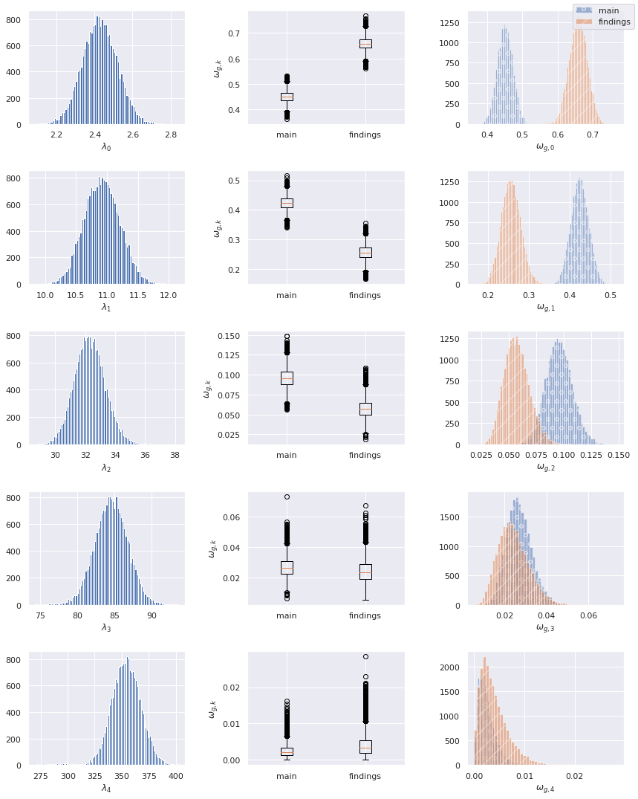
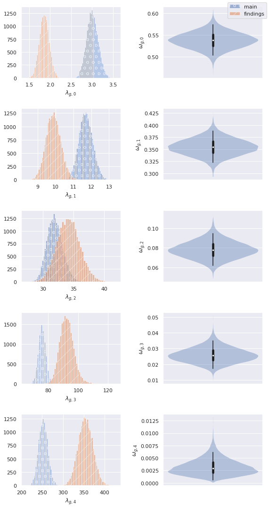

Bayesian data analysis (BDA) of citation counts for papers presented at the EMNLP main conference and Findings of EMNLP 2020.

If you plot the counts, you will see that a single Poisson distribution won't fit the data well, classic Frequentist tests struggle to handle the fact that there are hidden explanations (e.g., mixture of Poisson distributions with unknown rates) and they hinge on availability of infinite data. Here, we make an explicit hierarchical account of our assumptions (e.g., that we have an unknown mixture of unknown Poisson distributions) and use posterior inference to analyse plausible values for the latent parameters. As the parameters are themselves interpretable, we gain insights about the data. We can always criticise our assumptions, and come up with better models, and we should do that whenever we have evidence that the fit isn't good or whenever we feel like learning about an aspect of the data not yet accounted for by our latent variables.

Check the notebooks for a description of the analysis model.

## Group-specific DP mixture of shared Poisson components

Each row is a posterior component in a mixture model. 
* the first plot is the posterior Poisson rate, i.e., the distribution of expected counts
* the second plot shows the posterior mixing coefficients for each group (main conference, and findings), that is, the relative importance of this component to the group
* the third plot is the distribution of mixing coefficients

We can see up to 5 patterns (expressed in terms of posterior expected counts) and how important they are to the two groups. The last two patterns represent less than 5\% of the posterior mass.

## Shared DP mixture of group-specific Poisson components

Each row is a posterior component in a mixture model. 
* the first plot are the posterior Poisson rates for each group, i.e., the distribution of expected counts
* the second plot shows the posterior over a shared mixing coefficient, that is, the relative importance of the first group-specific component

We can see up to 5 patterns (expressed in terms of posterior expected counts), group-specific differences within the pattern, and how important they are to the two groups. The last two rows represent less than 5\% of the posterior mass.

